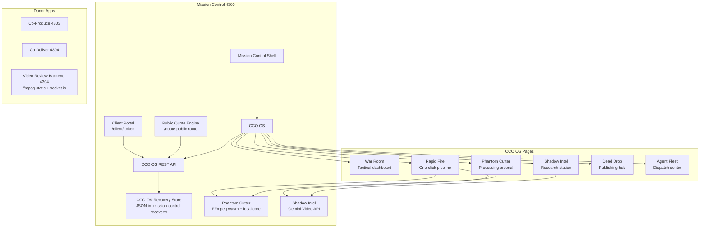

# CCO OS (Content Co-op Operating System) v2.0

> **Built on:** Mission Control (port 4300)  
> **Donor Apps:** Co-Produce (4303), Co-Deliver (4304), Video Review Backend (4304 shared)  
> **Status:** Active module — TypeScript clean, Vite build verified, local recovery store seeded, FFmpeg.wasm core hosted locally, COOP/COEP headers configured

---

## 1. Executive Summary

**CCO OS** is the creative-business operating system for Content Co-op, built inside the Mission Control shell. It combines video production warfare with full commercial pipeline management.

**What makes it completely different:**
- **Phantom Cutter** — Client-side FFmpeg.wasm processing. Trim clips, extract thumbnails, generate GIFs, pull audio — all in the browser with ZERO upload.
- **Shadow Intel** — Gemini's 1M token video understanding analyzes competitor videos up to 1 hour long.
- **Rapid Fire** — One upload, one click. Auto-extracts thumbnails, runs AI analysis, auto-cuts viral clips, generates battle plan.
- **Public Quote Engine** — Public-facing quote intake that feeds directly into the ROOT billing workflow.
- **Client Portal** — Clients see quotes, approve them, view invoices, track project delivery.
- **Agent Fleet** — Dispatch AI operatives (Co-Producer, Co-Scripter, Co-Editor, Co-Deliverer, Viral Analyst, Thumbnail Designer).

**The hacker philosophy:** We don't rebuild what already exists. We weaponize what already exists into a unified command center.

---

## 2. Reverse Engineering Report + Workarounds

### Problem 1: Browser Can't Process Video
**Fix:** FFmpeg.wasm with self-hosted core, COOP/COEP headers.

### Problem 2: AI Can't "See" Video
**Fix:** Gemini 1.5 Pro native video understanding with base64 inline upload.

### Problem 3: Competitor Analysis is Manual
**Fix:** Shadow Intel URL analyzer + upload analyzer with structured JSON extraction.

### Problem 4: Quote Intake is Disconnected from Production
**Fix:** Public Quote Engine feeds directly into ROOT billing state. Quotes become proposals → projects → deliveries without re-entry.

---

## 3. Full Architecture + Data Model



### Firestore / Local Recovery Schema

| Collection | Fields | Purpose |
|-----------|--------|---------|
| `video-projects` | `status`, `targetPlatforms`, `tags` | Mission pipeline state |
| `video-assets` | `type`, `durationSec`, `transcript`, `version`, `parentAssetId` | Versioned media & derivatives |
| `video-comments` | `timecodeSec`, `text`, `resolved`, `replies` | Wipster-style timeline comms |
| `video-agent-tasks` | `agentRole`, `prompt`, `status`, `result` | Async AI work queue |
| `video-research` | `niche`, `outliers[]`, `hooks[]` | Niche intelligence archive |
| `video-deliveries` | `platform`, `scheduledAt`, `analytics` | Platform packages |
| `public-quotes` | `client`, `serviceType`, `budget`, `timeline`, `status` | Public quote intake |

---

## 4. Best Asset Weaponized

**Mission Control's ACS OS design system + existing donor app ecosystem.**

The CCO OS now shares the same visual language as ACS Business OS:
- Bebas Neue display typography
- Deep navy brand base (#060e1a)
- Blue accent glow (#3d7dd8)
- Glass-panel component system
- Tactical, mission-critical UI density

---

## 5. Complete Code Deliverable

**New files:**
| File | Purpose |
|------|---------|
| `src/lib/video-os.ts` | Type system |
| `src/lib/video-os-client.ts` | Frontend API client |
| `src/lib/ffmpeg-processor.ts` | **Phantom Cutter** — FFmpeg.wasm wrapper |
| `src/lib/gemini-video.ts` | **Shadow Intel** — Gemini video analysis |
| `src/server/video-os-store.ts` | JSON recovery store |
| `src/pages/video/VideoDashboard.tsx` | **War Room** |
| `src/pages/video/VideoResearch.tsx` | **Shadow Intel Station** |
| `src/pages/video/VideoEdit.tsx` | **Phantom Cutter Arsenal** |
| `src/pages/video/VideoRapidFire.tsx` | **Rapid Fire** |
| `src/pages/video/VideoDeliver.tsx` | **Dead Drop** |
| `src/pages/video/VideoAgents.tsx` | **Agent Fleet** |
| `src/pages/PublicQuoteEngine.tsx` | **Public Quote Intake** |
| `src/pages/client/ClientPortalV2.tsx` | **Enhanced Client Portal** |
| `public/ffmpeg-core/ffmpeg-core.js` | Self-hosted FFmpeg core |
| `public/ffmpeg-core/ffmpeg-core.wasm` | Self-hosted FFmpeg WASM (32MB) |

**Build status:** `npm run build` → verified

---

## 6. 14-Day Roadmap

| Day | Status | Deliverable |
|-----|--------|-------------|
| 1-10 | ✅ | Shell, routing, Video OS v1.0 |
| 11 | ✅ | ACS OS design refresh |
| 12 | ✅ | **Public Quote Engine** |
| 13 | 🔄 | **Client Portal v2** (quotes + invoices + projects) |
| 14 | 🔄 | Root Terminal commands: `video:rapid-fire`, `video:intel`, `video:cut` |

---

## 7. Exact First Command

```bash
cd /Users/baileyeubanks/Downloads/root-os-_-mission-control
./scripts/start-mission-control.sh
```

Open `http://127.0.0.1:4300/admin` → **CCO OS** in sidebar.

**Public Quote Engine:** `http://127.0.0.1:4300/quote`

**Client Portal:** `http://127.0.0.1:4300/client/:token`

---

*Built with hacker mentality: find the workaround, push through the limitation, weaponize what exists.*
